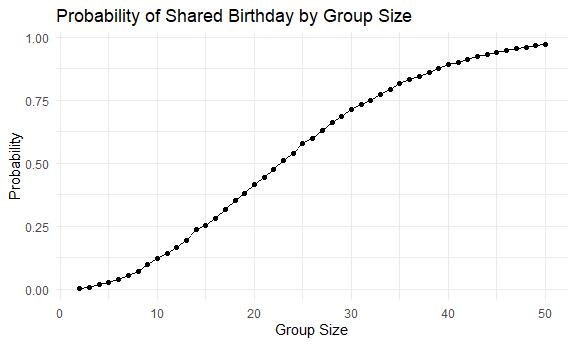
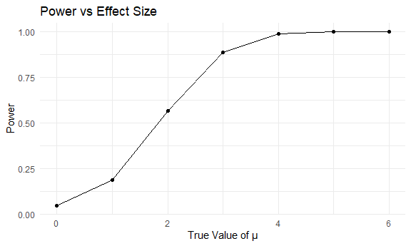
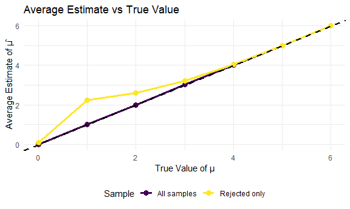
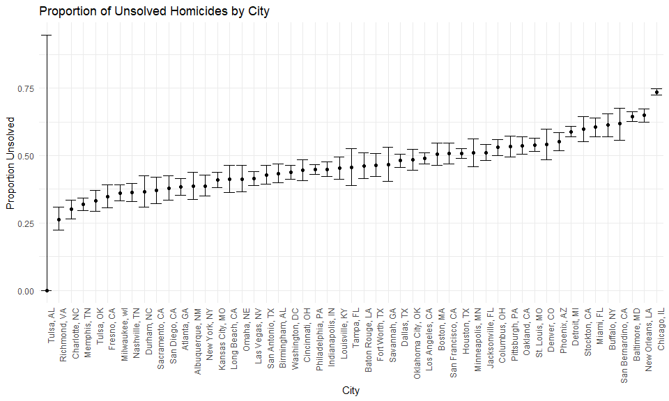

p8105_hw5_yl5906
================
Yujie Li
2025-11-10

## Problem 1: Birthday Problem

``` r
check_birthday = function(n) {
  birthdays = sample(1:365, n, replace = TRUE)
  has_duplicate = length(unique(birthdays)) < n
  has_duplicate
}
```

``` r
check_birthday(20)
```

    ## [1] FALSE

``` r
check_birthday(50)
```

    ## [1] TRUE

``` r
#Run simulation for group sizes 2 to 50, with 10000 iterations each.
set.seed(327)

birthday_sim = 
  expand_grid(
    group_size = 2:50,
    iter = 1:10000
  ) |> 
  mutate(
    result = map_lgl(group_size, check_birthday)
  ) |> 
  group_by(group_size) |> 
  summarize(
    probability = mean(result)
  )
```

``` r
birthday_sim |> 
  ggplot(aes(x = group_size, y = probability)) +
  geom_point() +
  geom_line() +
  labs(
    title = "Probability of Shared Birthday by Group Size",
    x = "Group Size",
    y = "Probability"
  )
```



the group size increases, the probability that at least two individuals
share a birthday increase rapidly. For a group of 23 people, this
probability exceeds 50%. When the group consists of 50 individuals, the
probability approaches 0.97. This demonstrates the famous “birthday
paradox”

## Problem 2: Power Simulation

``` r
#function simulate data and run t-test.
sim_t_test = function(mu, n = 30, sigma = 5) {
  
  sim_data = rnorm(n, mean = mu, sd = sigma)
  
  test_result = t.test(sim_data, mu = 0)
  
  test_result |> 
    broom::tidy() |> 
    select(estimate, p.value)
  
}
```

``` r
#Test function.
sim_t_test(mu = 0)
```

    ## # A tibble: 1 × 2
    ##   estimate p.value
    ##      <dbl>   <dbl>
    ## 1    0.590   0.470

``` r
#Generate 5000 datasets from the model with μ = 0
set.seed(327)

mu_zero_results = 
  expand_grid(
    mu = 0,
    iter = 1:5000
  ) |> 
  mutate(
    results = map(mu, sim_t_test)
  ) |> 
  unnest(results)
```

``` r
#Repeat for μ = {1, 2, 3, 4, 5, 6}
set.seed(327)

power_results = 
  expand_grid(
    mu = 0:6,
    iter = 1:5000
  ) |> 
  mutate(
    results = map(mu, sim_t_test)
  ) |> 
  unnest(results) |> 
  mutate(
    rejected = p.value < 0.05
  )
```

``` r
#plot
power_results |> 
  group_by(mu) |> 
  summarize(
    power = mean(rejected)
  ) |> 
  ggplot(aes(x = mu, y = power)) +
  geom_point() +
  geom_line() +
  labs(
    title = "Power vs Effect Size",
    x = "True Value of μ",
    y = "Power"
  )
```



association between effect size and power: As the effect size increases,
power increases. When μ = 0, power is 0.05 (approximately the Type I
error rate of 0.05). Power increases steadily, reaching 0.19 at μ = 1,
0.57 at μ = 2, 0.89 at μ = 3, and approaches 1.0 for μ ≥ 4 (power = 0.99
at μ = 4). Larger effect sizes are easier to detect.

``` r
#Average estimate for all samples
avg_all = 
  power_results |> 
  group_by(mu) |> 
  summarize(
    avg_estimate = mean(estimate)
  )

#Average estimate for rejected samples only
avg_rejected = 
  power_results |> 
  filter(rejected == TRUE) |> 
  group_by(mu) |> 
  summarize(
    avg_estimate = mean(estimate)
  )

#Combine and plot
avg_all |> 
  ggplot(aes(x = mu, y = avg_estimate)) +
  geom_point(aes(color = "All samples"), size = 3) +
  geom_line(aes(color = "All samples"), linewidth = 1.2) +
  geom_point(data = avg_rejected, aes(color = "Rejected only"), size = 3) +
  geom_line(data = avg_rejected, aes(color = "Rejected only"), linewidth = 1.2) +
  geom_abline(slope = 1, intercept = 0, linetype = "dashed", linewidth = 0.8) +
  labs(
    title = "Average Estimate vs True Value",
    x = "True Value of μ",
    y = "Average Estimate of μ̂",
    color = "Sample"
  )
```



Is the sample average of μ̂ across tests for which the null is rejected
approximately equal to the true value of μ? Why or why not?

No. When power is low (μ = 1, 2, 3), the average estimate among rejected
samples is noticeably higher than the true μ. For example, when μ = 1,
the average rejected estimate is approximately 2.23, much higher than 1.

This occurs because when power is low, only extreme estimates lead to
rejection, creating selection bias. As μ increases and power approaches
1, nearly all samples are rejected, reducing bias. The average estimate
among rejected samples then converges to the true μ. This is known as
the “winner’s curse.”

## Problem 3: Homicide Data

``` r
homicide_df = read_csv("D:/Columbia/2025fall/Data Science 1/HW5/p8105_hw5_yl5906/homicide-data.csv")
```

``` r
homicide_df
```

    ## # A tibble: 52,179 × 12
    ##    uid        reported_date victim_last  victim_first victim_race victim_age
    ##    <chr>              <dbl> <chr>        <chr>        <chr>       <chr>     
    ##  1 Alb-000001      20100504 GARCIA       JUAN         Hispanic    78        
    ##  2 Alb-000002      20100216 MONTOYA      CAMERON      Hispanic    17        
    ##  3 Alb-000003      20100601 SATTERFIELD  VIVIANA      White       15        
    ##  4 Alb-000004      20100101 MENDIOLA     CARLOS       Hispanic    32        
    ##  5 Alb-000005      20100102 MULA         VIVIAN       White       72        
    ##  6 Alb-000006      20100126 BOOK         GERALDINE    White       91        
    ##  7 Alb-000007      20100127 MALDONADO    DAVID        Hispanic    52        
    ##  8 Alb-000008      20100127 MALDONADO    CONNIE       Hispanic    52        
    ##  9 Alb-000009      20100130 MARTIN-LEYVA GUSTAVO      White       56        
    ## 10 Alb-000010      20100210 HERRERA      ISRAEL       Hispanic    43        
    ## # ℹ 52,169 more rows
    ## # ℹ 6 more variables: victim_sex <chr>, city <chr>, state <chr>, lat <dbl>,
    ## #   lon <dbl>, disposition <chr>

The raw data contains 52179 observations of homicides across 50 cities
in the United States. Variables include the victim’s name, race, age,
and sex. the date the homicide was reported; the location (city, state,
latitude, and longitude); and the disposition of the case (whether it
resulted in an arrest or remains unsolved).

``` r
#create city_state variable and summary
homicide_summary = 
  homicide_df |> 
  mutate(
    city_state = str_c(city, ", ", state),
    unsolved = disposition %in% c("Closed without arrest", "Open/No arrest")
  ) |> 
  group_by(city_state) |> 
  summarize(
    total_homicides = n(),
    unsolved_homicides = sum(unsolved)
  )

homicide_summary
```

    ## # A tibble: 51 × 3
    ##    city_state      total_homicides unsolved_homicides
    ##    <chr>                     <int>              <int>
    ##  1 Albuquerque, NM             378                146
    ##  2 Atlanta, GA                 973                373
    ##  3 Baltimore, MD              2827               1825
    ##  4 Baton Rouge, LA             424                196
    ##  5 Birmingham, AL              800                347
    ##  6 Boston, MA                  614                310
    ##  7 Buffalo, NY                 521                319
    ##  8 Charlotte, NC               687                206
    ##  9 Chicago, IL                5535               4073
    ## 10 Cincinnati, OH              694                309
    ## # ℹ 41 more rows

``` r
#use prop.test to estimate the proportion
baltimore_df = 
  homicide_summary |> 
  filter(city_state == "Baltimore, MD")

baltimore_test = 
  prop.test(
    x = baltimore_df |> pull(unsolved_homicides),
    n = baltimore_df |> pull(total_homicides)
  )

baltimore_test |> 
  broom::tidy() |> 
  select(estimate, conf.low, conf.high)
```

    ## # A tibble: 1 × 3
    ##   estimate conf.low conf.high
    ##      <dbl>    <dbl>     <dbl>
    ## 1    0.646    0.628     0.663

``` r
#run for each
prop_test_city = function(city_df) {
  
  test_result = 
    prop.test(
      x = city_df |> pull(unsolved_homicides),
      n = city_df |> pull(total_homicides)
    )
  
  test_result |> 
    broom::tidy() |> 
    select(estimate, conf.low, conf.high)
  
}

all_cities = 
  homicide_summary |> 
  nest(data = c(total_homicides, unsolved_homicides)) |> 
  mutate(
    test_results = map(data, prop_test_city)
  ) |> 
  select(-data) |> 
  unnest(test_results)

all_cities
```

    ## # A tibble: 51 × 4
    ##    city_state      estimate conf.low conf.high
    ##    <chr>              <dbl>    <dbl>     <dbl>
    ##  1 Albuquerque, NM    0.386    0.337     0.438
    ##  2 Atlanta, GA        0.383    0.353     0.415
    ##  3 Baltimore, MD      0.646    0.628     0.663
    ##  4 Baton Rouge, LA    0.462    0.414     0.511
    ##  5 Birmingham, AL     0.434    0.399     0.469
    ##  6 Boston, MA         0.505    0.465     0.545
    ##  7 Buffalo, NY        0.612    0.569     0.654
    ##  8 Charlotte, NC      0.300    0.266     0.336
    ##  9 Chicago, IL        0.736    0.724     0.747
    ## 10 Cincinnati, OH     0.445    0.408     0.483
    ## # ℹ 41 more rows

``` r
#create plot shows the estimates and CI for each city
all_cities |> 
  mutate(
    city_state = fct_reorder(city_state, estimate)
  ) |> 
  ggplot(aes(x = city_state, y = estimate)) +
  geom_point() +
  geom_errorbar(aes(ymin = conf.low, ymax = conf.high)) +
  labs(
    title = "Proportion of Unsolved Homicides by City",
    x = "City",
    y = "Proportion Unsolved"
  ) +
  theme(axis.text.x = element_text(angle = 90, hjust = 1))
```


The plot shows substantial variation in unsolved homicide proportions
across cities. Chicago, IL has the highest proportion at approximately
0.74, while Richmond, VA has among the lowest at approximately 0.26.
Most cities fall in the range of 0.3 to 0.6 for the proportion of
unsolved homicides.
